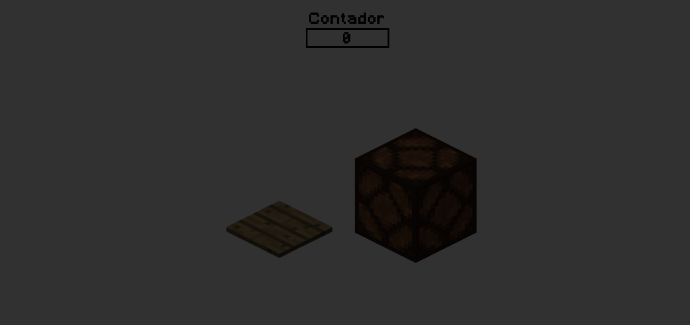
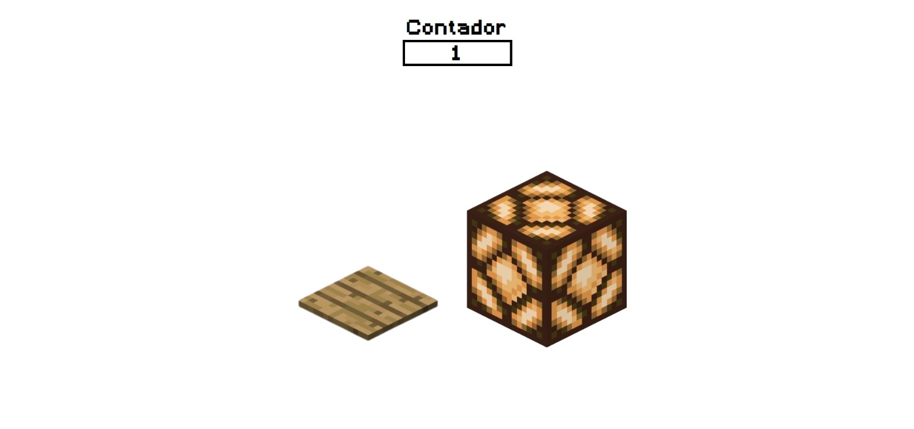

# 💡 Projeto 1: Controle de Luz – Simulador de Interruptor

## 📝 Descrição

Este projeto consiste em um simulador de interruptor digital que permite ligar e desligar uma lâmpada virtual por meio de um botão. Desenvolvido com HTML, CSS e JavaScript puros, o projeto explora conceitos fundamentais como manipulação do DOM, eventos e controle de classes usando `classList.toggle()`.

---

## 📸 Imagens

### Lâmpada Apagada



### Lâmpada Acesa



---

## ⚙️ Funcionalidades

* [x] Lâmpada virtual com imagens para os estados **acesa** e **apagada**
* [x] Botão que **liga/desliga** a lâmpada
* [x] Texto do botão atualizado dinamicamente (**"Ligar" / "Desligar"**)
* [x] **Sem uso de frameworks** (apenas HTML, CSS e JS puros)

---

## ✨ Melhorias Implementadas (opcionais)

* [ ] **Efeito de fade-in/fade-out** ao trocar a imagem da lâmpada
* [x] **Plano de fundo dinâmico**, simulando um ambiente claro e escuro
* [x] **Contador** de vezes que a luz foi acesa

---

## 🔧 Como modificar a imagem usada

As imagens da lâmpada estão localizadas na pasta `/img`. Para trocar as imagens:

1. Substitua os arquivos `lamp-on.png` e `lamp-off.png` por outras imagens com o mesmo nome.
2. Ou, edite o código no JavaScript para apontar para o novo caminho da imagem, por exemplo:

```javascript
lampImage.src = isOn ? './img/minha-lampada-acesa.png' : './img/minha-lampada-apagada.png';
```

---

## 📚 Explicação: `classList.toggle()`

A função `classList.toggle()` é usada para adicionar ou remover uma classe de um elemento HTML. Se a classe já existir, ela será removida; se não existir, será adicionada. Neste projeto, ela é usada para aplicar estilos diferentes dependendo do estado da lâmpada.

Exemplo no código:

```javascript
document.body.classList.toggle('light-on');
```

Neste caso, a classe `light-on` é alternada no `<body>` para mudar o plano de fundo da página conforme o estado da lâmpada.

---

## 🛠️ Tecnologias Utilizadas

* HTML5
* CSS3
* JavaScript 

---

## 📁 Estrutura de Arquivos

```
luz/
│
├── index.html
├── minecraft.ttf
├── style.css
├── script.js
├── img/
│   ├── lampMineOn.png
│   ├── lampMine.png
│   ├── plate.png
│   └── steve.png
└── sound/
    └── tok.mp3
```
